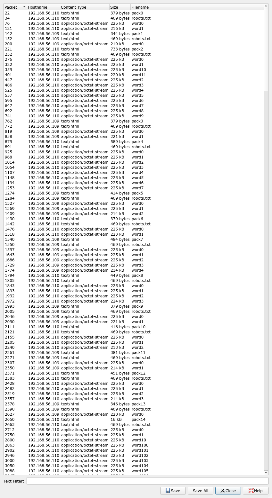
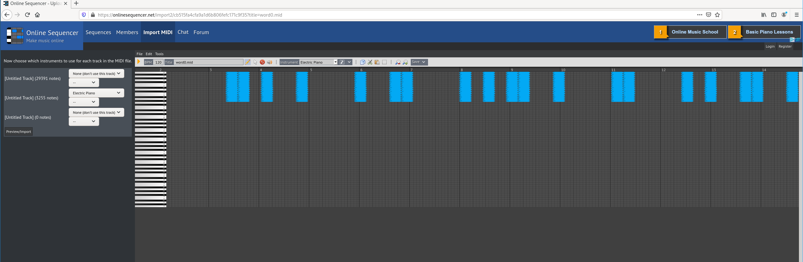
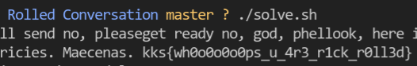

# Rolled Conversation


**Category:** Insane

**Points:** 997

**Description:**

We have intercepted some strange dialog between two infected hosts. Please, help us decode this and get kackers plans

https://drive.google.com/open?id=158byn_W3izzQLBqPlo3IAa4zUy0bGp15

@anfinogenov

## WriteUp 

> Task files are generated by [task.py](task.py)

### Forensics

Pcap? Wireshark! ~~Hotel? Trivago!~~

What we see inside? There are two hosts: `192.168.56.109` and `192.168.56.110`, and they are downloading files from each other with `wget` (seen in User-Agent header). So, protocol is HTTP. Lets see what files kackers are downloading with help of "Export Objects > HTTP"



Let's try to save all objects from .pcap to `./conversation/` and analyse this files.

`robots.txt` seems to be static and gives no usable info.

What are this `word*` files? With `file` utility we can figure out that info:
```sh
$ file word0 
word0: Standard MIDI data (format 0) using 2 tracks at 1/43
```

Woah! MIDI! That's an audio format. But if we try to listen to it, we only hear some noisy music, definitely not what we are looking for. If you are high enough, you can identify this song as "Never gonna give you up" by Rick Astley.

### Visualisation

If we visualise two tracks of this MIDI file, we'll see that track 2 is suspiciously structurized. But what is it? Binary sequence? Seems not - couldn't decode. Any other types of binary-like encodings? Failed again.



But, if we reduce the visualisation enough, we'll see that these stripes are similar to a barcode.

> Finally, orgs gave participants this hint:  


And if we decode this as a barcode... we'll get a meaningful english text! Hooray! Now we need to automatize decoding of these MIDIs to text.

### Solver 

1. Write [solve.py](solve.py) to decode one stegocontainer

2. Write [solve.sh](solve.sh) to decode all containers in folder

3. ???

4. Profit!

So, here is our flag: `kks{wh0o0o0o0ps_u_4r3_r1ck_r0ll3d}`



PS. Since wireshark exporter does not export directories (as pack0, pack1), it's harder to export all conversation in right order. With our script [solve.sh](solve.sh) conversation looks a little scrambled. For original conversation visit [conversation.txt](conversation.txt). But it's not necessary.