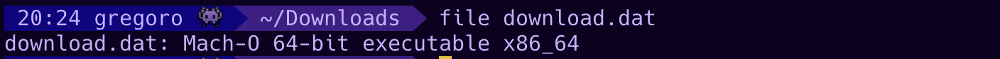

# Russian Government Process


**Category:** Insane

**Points:** 988

**Description:**

To counteract kackers, you decided to create an organization for the implementation of paper security mechanisms. Unfortunately (or fortunately) you decided to create this organization in Russia. 

Read all the necessary documents and go through this paper Russian Government Process.

To complete this task, we have sent you a package of necessary documents. It includes a worker's memo, a short life story, a lunch menu, and an accounting form.

You will find some parts of the necessary information in these papers.

Be sure to look to create an atmosphere - > https://www.youtube.com/watch?v=B6bN_T92SYY


P.S. The Finance.pdf file has moved a little, but it does not interfere with the solution

@greg0r0

## WriteUp
First of all, it should be noted that there are four files in this task - four different tasks. Each task contains a part of the flag.

---

**Task-1. File [Work_Instruction.docx](papers/Work_Instruction.docx). Category: Pure stego.**

This task uses some features of .docx files structure. Format .docx is just zipped directory with special files like xml and data files (pictures and etc). Also it's possible to add your own files, for example some text file.

Let's check the document: 


Hmm, no flag part here.
But we can notice one of lines: `6) Carefully look and check file here`.  
And text at end of file tells the order of flag parts.

Unzip .docx (change file format to .zip). Structure of this unpacked .docx:


Just print content of the file `part_of_flag.txt`:

```
# cat Work_Instruction/docProps/part_of_flag.txt
6b6b737b317473
```

It's a part of the flag in hex encoding (little protection from grep)

**Part:** `kks{1ts`

---

**Task-2. Files in [files.zip](papers/files.zip). Category: PPC.**

It is file with big amount of pictures with numbers. Also there is a part of big base64-encoded data in its names.

Run your OCR tool (like tesseract) and sort names of files according to the numbers on pictures (or sort files manually with your hands :) ).

Tip for tesseract-ocr:
1. Change standard settings and choose "only numbers" recognition mode.
2. Increase twice (or more) resolution of the pictures - it will increase chance of correct number recognition.

Then decode base64 and you will get a long text with a story about hackers. Here is a flag part in the middle of this text.

**Part:** `_s1mpl3`

---

**Task-3. File [base_lunch_menu.jpg](papers/base_lunch_menu.jpg). Category: stego+reverse.**

Hm, we see some lunch menu on this picture. 
`Base` in file name is a little tip. Grep this file for base64 strings (simpliest way is to use `strings` util). You will see a very big base64 string at the end of file. Decode it (for example, with [CyberChef](https://gchq.github.io/CyberChef/)):


Seems like it is some kind of binary file. Download it and check its signature:



Yep, its macho exec file. Let's run `radare2` and check entry0 in graph mode (you can find more detailed description of radare2 usage in writeup for [Buffalo Reverse](../../Reverse/Buffalo%20Reverse) ).


Here you can see some values, which are added up and let out as hex sum. Decode it from hex and get part of a flag.

**Part**: `_just`

---

**Task-4. File [finance.pdf](papers/finance.pdf). Category:trivia (just use your eyes)"**

This is real form of finance report in Russia :)
So real that the markup got a little off (I've just downloaded it from official site of Russian Tax Authority).

Form was filled with random values and completed the date placeholder under the big signature with part of flag.


**Part**: `_d0cum3nt4t10n}`


**Flag:** `kks{1ts_s1mpl3_just_d0cum3nt4t10n}`

---

Thank you for solving!
