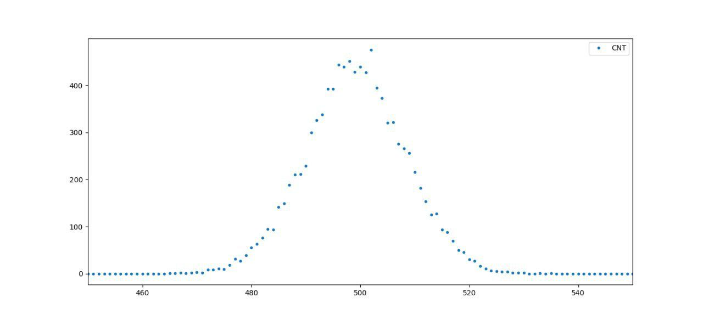
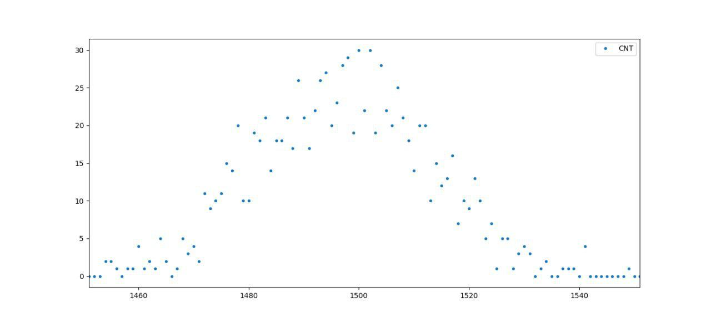

# Christmas quest

**Category:** Misc

**Points:** 983

**Description:**

Hey there!

So right before New Year's, we decided to go through all of the old stuff at the faculty office. Guess what we found among all the boxes! There were a whole bunch of floppy disks right from the 90s and such. Really looked like dinosaurs used those. Because there are no disk trays on the Macbooks that we use, we had to get a super old PC running (barely managed to boot the damn thing).

One of the floppies was quite interesting. It had a console-based game on it, similar to ones that were popular in the 80s. I tried it and got stuck on the first enemy! Maybe you'll manage to get further? We ended up putting the game on our server, be sure to check it out here:

`nc tasks.open.kksctf.ru 8005`

P. S. There's an intriguing file I found in the game's folder. Looks like something out of the source files. Maybe it can help somehow?

P.P.S Use Cool Retro Term for better experience

https://drive.google.com/open?id=1jwH63jg_aSV9Hzr6y30c2TfP_ozUxGta

## WriteUp 
First of all, let's take a closer look at the file *rand.h*. In the function `a_random_number()`, in this exact loop, we can see a summation of numbers which pretend to be random:

    for (uint32_t i = 0 ; i < LIMIT ; i++, sum += (float)rand_vals[i] / (uint8_t)(~0)) ;

Let's assume that the random numbers are distributed uniformly on interval *(0, 1)*, which means they can take values from 0 to 1 with (approximately) the same likelihood. A sum of random numbers also appears in one of the most important theorems of probability theory, a central limit theorem, which establishes that the sum of independent identically distributed random values tends towards a normal distribution with a growth of number of values. Knowing this, we can now expect that output value will most likely be distributed normally.

To prove that, let's use this code to generate a bunch of values and plot a graph of their frequency distribution (e.g. with Python's matplotlib). For 1,000 experiments we got something like this:

This looks pretty Gaussian. The expected value here is *LIMIT/2 = 500*, and variance is *LIMIT/12=83* (*1/12* for a single uniformly distributed value). As we can see in *resultsCompare()*, with a growth of enemy's level, more summation takes place. Level 3 enemy produces such distribution:

Not as smooth as previous one (it's all due to higher variance), still it has an explicit expectation equal to *3LIMIT/2*. According to this logic, we have a formula for expectation *E=LEVEL*LIMIT/2*. Now what about the dice?

Don't mind the horrible *rand()*, we can use it to aim for calculated expectation. Expectation of a single die roll is *(s + 1)/2*, where *s* is a number of sides. For *n* independent rolls, expectation is *n(s + 1)/2*. So, we have a formula for a number of rolls for a randomly picked die: *n(s + 1)/2 = E* *=>* *n = 2E/(s + 1) = LEVEL*LIMIT/(s + 1)=1000*LEVEL/(s + 1)*.This should work in most cases, the rest is a matter of chance.

P. S. I hope you didn't chose the green button on you first try.

flag: `flag{kks{M3rry_Chr157m45_4nd_4_H4ppy_N3w_Y34r!_W17h_l0v3,_KKS_TEAM}}`
