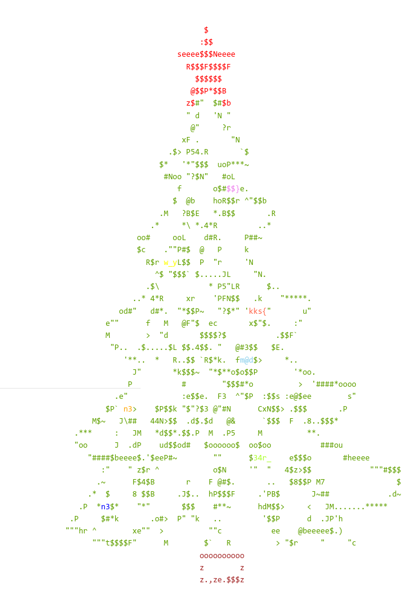

# Xmas Tree


**Category:** Misc

**Points:** 100

**Description:**

Do you like to decorate the Christmas tree?

## WriteUp 


On the any page of open.kksctf.ru we could find this christmas tree:  


And source code for this tree is:
```html
<pre id="background">
                               <span style="color: red;">$</span>
                              <span style="color: red;">:$$</span>
                         <span style="color: red;">seeee$$$Neeee</span>
                           <span style="color: red;">R$$$F$$$$F</span>
                             <span style="color: red;">$$$$$$</span>
                            <span style="color: red;">@$$P*$$B</span>
                           <span style="color: red;">z$</span>#"  $#<span style="color: red;">$b</span>
                           " d   'N "
                            @"     ?r
                          xF .       "N
                       .$> P54.R       `$
                     $*   '*"$$$  uoP***~
                      #Noo "?$N"   #oL
                         f       o$#<span style="color: violet;">$$}</span>e.
                        $  @b    hoR$$r ^"$$b
                     .M   ?B$E   *.B$$       .R
                   .*     *\ *.4*R         ..*
                oo#     ooL    d#R.     P##~
                $c    .""P#$  @   P     k
                  R$r <span style="color: yellow;">w_y</span>L$$  P  "r     'N
                    ^$ "$$$` $.....JL     "N.
                  .$\           * P5"LR      $..
               ..* 4*R     xr    'PFN$$   .k    "*****.
            od#"   d#*.  "*$$P~   "?$*" '<span style="color: tomato;">kks{</span>"       u"
         e""      f   M   @F"$  ec       x$"$.     :"
         M        >  "d       $$$$?$           .$$F`
          "P..  .$.....$L $$.4$$. "   @#3$$   $E.
             '**..  *   R..$$ `R$*k.  f<span style="color: skyblue;">m@d</span>$>     *..
               J"       *k$$$~  "*$**o$o$$P        '*oo.
              P           #        "$$$#*o          >  '####*oooo
           .e"            :e$$e.  F3  ^"$P  :$$s :e@$ee        s"
         $P` <span style="color: orange;">n3</span>>    $P$$k "$"?$3 @"#N      CxN$$> .$$$       .P
      M$~   J\##   44N>$$  .d$.$d   @&      `$$$  F  .8..$$$*
  .***     :   JM   *d$$*.$$.P  M  .P5     M          **.
  "oo      J  .dP    ud$$od#   $oooooo$  oo$oo           ###ou
     "####$beeee$.'$eeP#~        ""      $<span style="color: greenyellow;">34r_</span>    e$$$o       #heeee
        :"    " z$r ^            o$N     '"  "   4$z>$$             """#$$$
       .~      F$4$B       r    F @#$.       ..   $8$$P M7                $
     .*  $     8 $$B     .J$..  hP$$$F     .'PB$       J~##             .d~
   .P  *<span style="color: blue;">n3</span>$*    "*"       $$$    #**~      hdM$$>     <   JM.......*****
 .P     $#*k       .o#>  P" "k   ..         '$$P      d  .JP'h
"""hr ^        xe""  >          ""c           ee    @beeeee$.)
      """t$$$$F"      M        $`   R          > "$r     "     "c
                              <span style="color: brown;">oooooooooo</span>
                              <span style="color: brown;">z        z</span>
                              <span style="color: brown;">z.,ze.$$$z</span>
                </pre>
```

If we extract all spans in rainbow order, we'll get the flag:
```html
<span style="color: red;">$</span>
<span style="color: red;">:$$</span>
<span style="color: red;">seeee$$$Neeee</span>
<span style="color: red;">R$$$F$$$$F</span>
<span style="color: red;">$$$$$$</span>
<span style="color: red;">@$$P*$$B</span>
<span style="color: red;">z$</span>
<span style="color: red;">$b</span>
<span style="color: tomato;">kks{</span>
<span style="color: orange;">n3</span>
<span style="color: yellow;">w_y</span>
<span style="color: greenyellow;">34r_</span>
<span style="color: skyblue;">m@d</span>
<span style="color: blue;">n3</span>
<span style="color: violet;">$$}</span>
<span style="color: brown;">oooooooooo</span>
<span style="color: brown;">z        z</span>
<span style="color: brown;">z.,ze.$$$z</span>
```

Flag is `kks{n3w_y34r_m@dn4$$}`