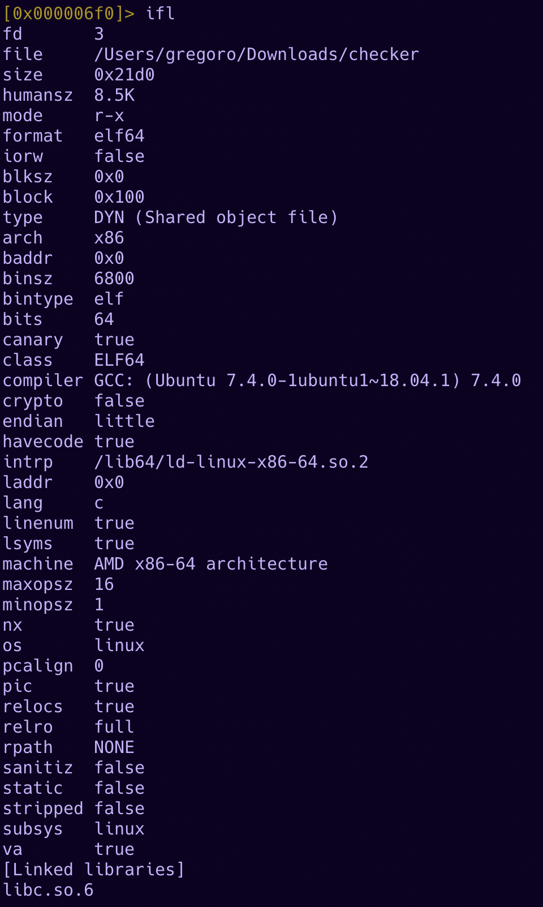
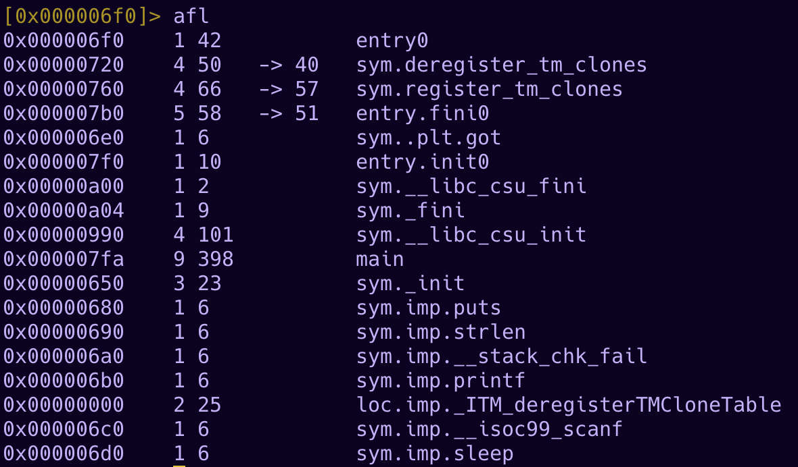
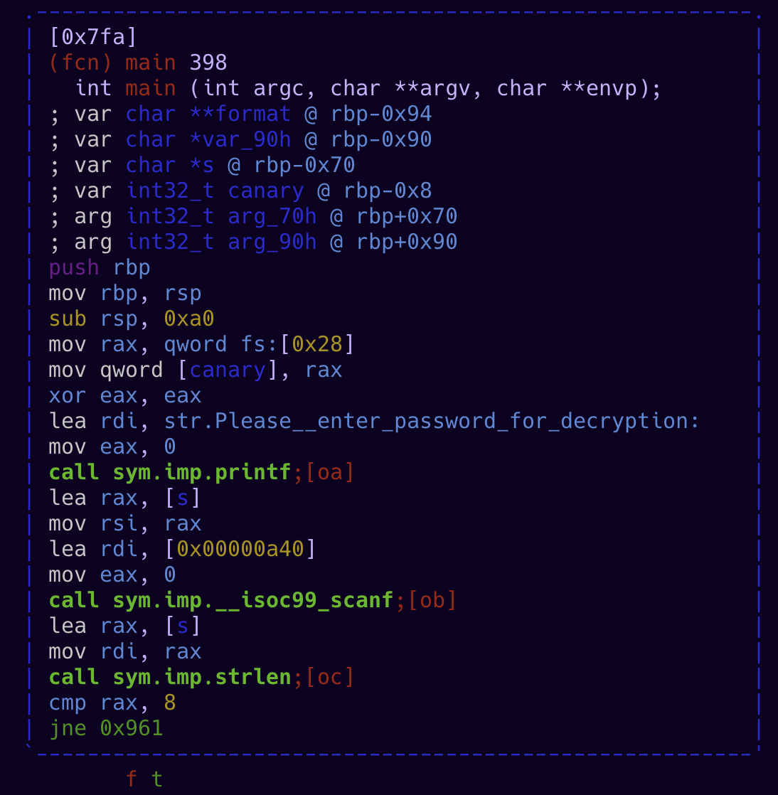
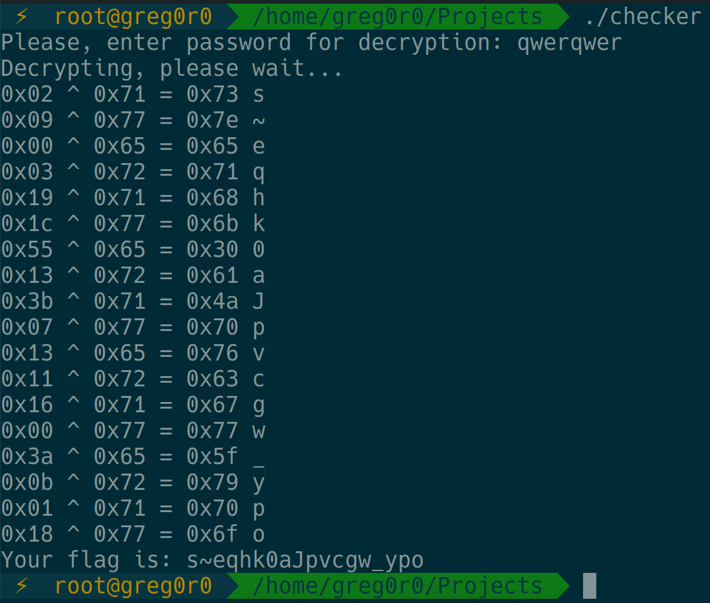

# Buffalo Reverse


**Category:** Reverse

**Points:** 100

**Description:**

Buffalo dead while reversing this task.

Warning:
Flag format is changed (not kks)! But it still using brackets.

@greg0r0

## WriteUp 
First of all, I want to apologize for little ucucuga - changing the format of the flag was a bad idea.

At the result task had two solutions:

1) Just guess the password - task text has big tips for guessing password, it was ```deadbeef```. Enter it and get flag.

2) Reverse+Brute

Open it in any decompiler, for example radare2.

```
r2 -A checker
```

First of all get info about this file. It's simple x64 ELF file, password checker.
```
[0x000006f0]> ifl
```



Then, if you check the strings , you won't find anything with flag format because the flag is encrypted. You can get strings in r2 with izz command:
```
[0x000006f0]> izz
```

In next step lets check for functions name (file is not stripped):
```
[0x000006f0]> afl
```



It seems that all logic in main section. Let's open it (in graph visual mode):
```
[0x000006f0]> VV @ main
```



Here we can see that the password length is checked, it should be equal to 8.
(On this stage you also can guess password)

If the password length is 8 will start decrypting process - even if the password is not correct. In decrypting process you can see xor sign - ^. At left column you can see encrypted bytes of flag, at right - bytes of key.



With few 0x00 bytes you can get part of key - e and a (using bruteforce or smth else). On this stage guess the part of password (with tip from task description) and get full flag. Password if deadbeef.

Or you also can bruteforce standart flag formats - CTF{}, flag{} and etc.

**Flag:**
flag{y0u_brute_me}
